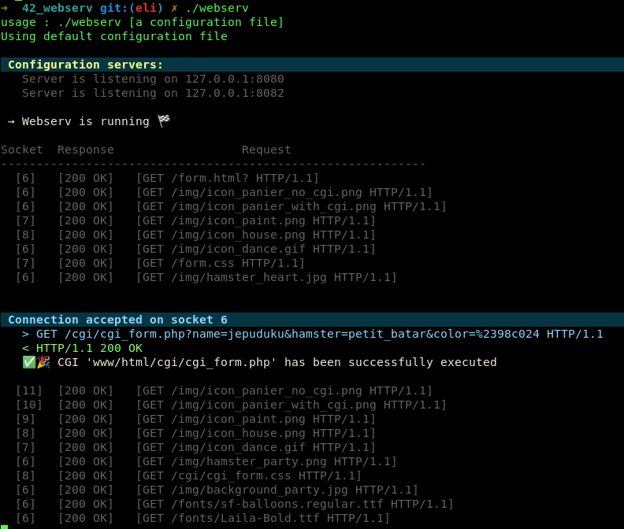

# Webserv

Project done with [vietdu91](https://github.com/vietdu91) and etran.

_[Subject]_
Write a HTTP server in C++98. The executable will be run as follows: **./webserv [configuration file]**. NGINX may be used to compare headers and answer behaviors.

 

    

